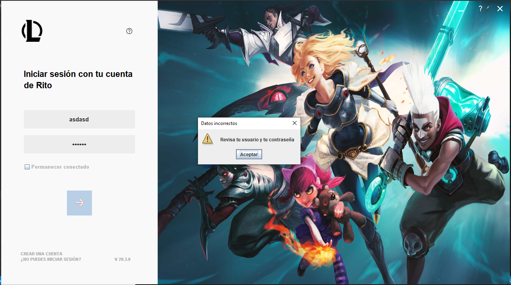
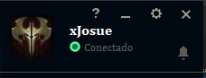
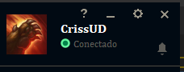
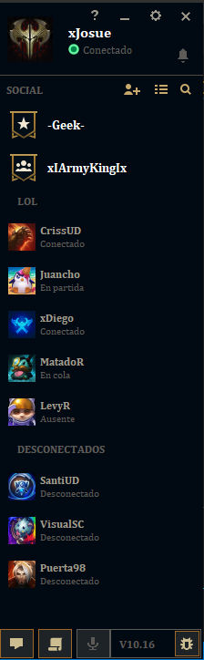

# Actividad # 9 - Servicios logicos
## Josue Nuñez Prada

En esta actividad se crea y hace uso de dos servicios logicos.

El primer servicio que se agrego fue el UsuarioService que junto al ControlUsuario valida los datos ingresados por el usuario para aceptar o no su ingreso. Una vez ingresado el usuario se pone su nombre e imagen (datos obtenidos con el servicio) en la vista principal.

El la vista principal se uso el servicio de AmigosService para traer todos los amigos de un archivo txt y se insertaron en el panel lateral haciendo uso de la reutilizacion del componente Amigos.

Este repositorio contiene el codigo de la novena actividad, correspondiente al uso de servicios logicos
